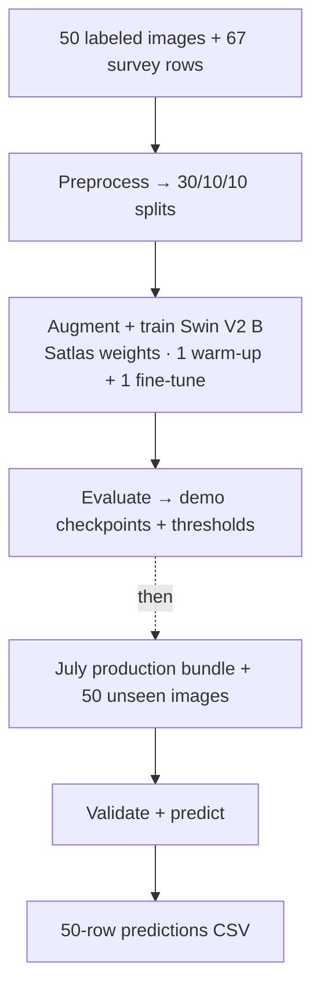

# GreenSpace_CNN

GreenSpace_CNN is a multi-task PyTorch/TorchGeo pipeline for learning perceived
green-space characteristics from aerial imagery and multi-rater survey labels.
The active model uses a Satlas-pretrained Swin V2 B backbone with shared image
features and four output heads:

- seven binary features (gardens is currently excluded);
- path shade (two classes);
- structured/unstructured score (1–5 regression);
- vegetation distribution score (1–5 regression).

TensorFlow/Keras notebooks remain as historical references. New training,
evaluation, packaging, and demonstration work is PyTorch-first.

## Current status (July 2026)

The approved raw survey is now fixed because rating has commenced:

| Stage | Count |
|---|---:|
| Raw survey response rows | 8,651 |
| Included ratings (`include_tile == yes`) | 8,297 |
| Aggregated labeled images | 5,518 |
| Training images | 3,311 |
| Validation images | 1,104 |
| Test images | 1,103 |

The 34 exact duplicate raw-row copies are intentionally retained. The
preprocessing pipeline aggregates every included row by image and does not edit
the raw survey.

The latest completed full run is
`PyTorch_20260719_full_windows`. It used 5 frozen-backbone warm-up epochs and
24 end-to-end fine-tuning epochs (29 total, about 6.56 hours) before early
stopping. The configured full-run ceiling is 100 fine-tuning epochs.

Best-MCMAE checkpoint test results:

| Metric | Test value |
|---|---:|
| Macro PR-AUC | 0.8770 |
| Macro ROC-AUC | 0.9354 |
| Macro F1 at validation-tuned thresholds | 0.8057 |
| Shade accuracy | 0.6582 |
| Structured-score MAE vs. rater mean | 0.5584 |
| Vegetation-score MAE vs. rater mean | 0.4172 |

These values come from
`report_outputs/runs/PyTorch_20260719_full_windows/overall_metrics_by_split_best_mcmae.csv`.
Generated reports and model files are ignored by Git.

## Packaged workflow

| Step | Interface | Status |
|---|---|---|
| Google Drive image download | `scripts/download_drive_images.py` | Ready |
| Survey preprocessing and splitting | `scripts/preprocess.py` | Ready |
| Resumable PyTorch training | `scripts/train_torch.py` | Ready |
| Saved-history epoch visual | `scripts/plot_training_curves.py` | Ready |
| Evaluation and validation threshold tuning | `scripts/evaluate_torch.py` | Ready |
| Standalone prediction CLI | `scripts/predict_torch.py` | Ready |
| Workstation state-tree inference CLI | `scripts/predict_state_tree.py` | Ready |
| Workstation prediction coordinate join | `scripts/append_patch_coordinates.py` | Ready |
| State score maps clipped to parks (combined CSV, GeoPackage, mean GeoTIFF, PNGs) | `scripts/map_state_scores.py` | Ready |
| Read-only pipeline validation CLI | `scripts/validate_pipeline.py` | Ready |
| End-to-end 50-image showcase | `notebooks/CORE_pipeline_v1.ipynb` | Ready |

Prediction loads one explicit portable run bundle: the selected checkpoint,
its saved model configuration, and the matching validation-tuned threshold
CSV. The validation command checks readiness without launching training,
evaluation, or prediction.

### Reviewer path



The training demo uses the production model and data path with a shortened
1+1 schedule; its metrics are pipeline evidence, not performance evidence.

## Install

Python 3.11 is the tested environment.

PowerShell:

```powershell
py -3.11 -m venv .venv
.\.venv\Scripts\Activate.ps1
python -m pip install --upgrade pip
python -m pip install -r requirements.txt
python scripts/check_python_version.py
```

macOS/Linux:

```bash
python3.11 -m venv .venv
source .venv/bin/activate
python -m pip install --upgrade pip
python -m pip install -r requirements.txt
python scripts/check_python_version.py
```

TensorFlow is not required for the active PyTorch workflow.

## External-review clean-clone setup

Download these three archives from the
[GreenSpace_CNN external-review files](https://drive.google.com/drive/folders/1tlsfN30WkAFBkwEmtTJmGt-uA6KbKXZA):

| Archive | Purpose |
|---|---|
| `GreenSpace_CNN_training_demo_50_v1.zip` | 67 raw survey rows (66 included ratings) and their 50 labeled images |
| `PyTorch_20260719_full_windows.zip` | July production checkpoint, model configuration, and thresholds |
| `GreenSpace_CNN_unseen_inference_50_v1.zip` | Separate 50-image unlabeled prediction set |

Data and model payloads are intentionally excluded from Git. A clean clone may
therefore lack `data/core_pipeline_demo/raw/` and `models/runs/`; creating these
two input parents and extracting the three archives are manual steps. On
macOS/Linux:

```bash
mkdir -p data/core_pipeline_demo/raw models/runs
```

On PowerShell:

```powershell
New-Item -ItemType Directory -Force -Path data/core_pipeline_demo/raw, models/runs
```

Extract both 50-image archives into `data/core_pipeline_demo/raw/`. Extract the
production model archive into `models/runs/`. Before opening the notebook, the
relevant payload must have this exact layout:

```text
data/core_pipeline_demo/raw/
├── training_demo_50/
│   ├── demo50_survey_response.csv
│   └── images/                       # exactly 50 labeled images
└── review50_unseen/                  # exactly 50 unlabeled images

models/runs/PyTorch_20260719_full_windows/
├── best_mcmae_PyTorch_20260719_full_windows.pt
├── model_config_PyTorch_20260719_full_windows.json
└── thresholds_best_mcmae.csv
```

Do not rename the model run directory or its three files. The reviewer does not
manually create derived folders: preprocessing creates the demo interim and
processed trees, training creates a new model run, evaluation creates monitoring
and report folders, and prediction creates `predictions/review_trial/`.

After installation and extraction, open
[`notebooks/CORE_pipeline_v1.ipynb`](notebooks/CORE_pipeline_v1.ipynb) and run
the cells in order. It performs the 67-row/50-image package preflight,
preprocessing and 30/10/10 split, actual augmented and oversampled input-loader
inspection, production-equivalent Swin V2 B + Satlas 1+1 training, demo
evaluation and threshold tuning, production-bundle validation, and separate
unseen-image prediction. The first training run needs network access if the
TorchGeo Satlas weight is not already cached; an accelerator is strongly
recommended.

## Prediction-only CLI trial: 50 unseen images

This reviewer path does not require Google Drive authentication, survey data,
split manifests, preprocessing, training, or evaluation. The current
`requirements.txt` installs the full project environment; a smaller
inference-only dependency file is not yet provided.

Only `PyTorch_20260719_full_windows.zip` and
`GreenSpace_CNN_unseen_inference_50_v1.zip` are needed when the reviewer wants
to skip the notebook's preprocessing and training demonstration.

Extract the model bundle without renaming its directory or internal files:

```text
models/runs/PyTorch_20260719_full_windows/
├── best_mcmae_PyTorch_20260719_full_windows.pt
├── model_config_PyTorch_20260719_full_windows.json
└── thresholds_best_mcmae.csv
```

See [`models/README.md`](models/README.md) for the external-artifact contract
and reference checksums. The extracted image sample is:

```text
data/core_pipeline_demo/raw/review50_unseen/
```

That directory must contain exactly 50 top-level JPG, JPEG, or PNG files;
subdirectories are not scanned. The model and image input directories must
exist before running the commands below. The prediction output directory is
created automatically.

First validate the real bundle and all 50 input filenames without requiring
labeled data:

```console
python scripts/validate_pipeline.py --checkpoint models/runs/PyTorch_20260719_full_windows/best_mcmae_PyTorch_20260719_full_windows.pt --skip-data --inference-dir data/core_pipeline_demo/raw/review50_unseen --output-dir predictions/review_trial --device cpu
```

Every validation check should report `PASS`, including `Inference images: 50`.
Validation checks supported filenames but does not fully decode every image, so
run a five-image inference smoke test next:

```console
python scripts/predict_torch.py --checkpoint models/runs/PyTorch_20260719_full_windows/best_mcmae_PyTorch_20260719_full_windows.pt --image-dir data/core_pipeline_demo/raw/review50_unseen --dataset-tag review50_unseen --limit 5 --output-dir predictions/review_trial --device cpu
```

Then predict all 50 images by omitting `--limit`:

```console
python scripts/predict_torch.py --checkpoint models/runs/PyTorch_20260719_full_windows/best_mcmae_PyTorch_20260719_full_windows.pt --image-dir data/core_pipeline_demo/raw/review50_unseen --dataset-tag review50_unseen --output-dir predictions/review_trial --device cpu
```

The two outputs are:

```text
predictions/review_trial/predictions_PyTorch_20260719_full_windows_review50_unseen_sample5.csv
predictions/review_trial/predictions_PyTorch_20260719_full_windows_review50_unseen.csv
```

The full command should report `Images: 50`. Its CSV contains 50 unique image
rows and 19 columns for the current seven-binary-label model. Existing output
files are protected; use a new dataset tag or pass `--overwrite` explicitly
when a replacement is intended.

## Add patch centers to workstation state predictions

After `scripts/predict_state_tree.py` finishes, run the coordinate join against
the same `--image-root` used for inference. The raw state tree must still contain
each park's `tables/<park_code>_patch_points.csv`. Pass one state's prediction
directory at a time. This step uses only the Python standard library and does
not load the model or rerun inference.

```powershell
$Python = (Resolve-Path ".\.venv\Scripts\python.exe").Path
& $Python scripts\append_patch_coordinates.py --image-root "Z:\GEE Derived" --predictions-dir "Z:\GEE Derived\inference_outputs\<run-id>\states\USA_AL"
```

For the local Alabama copy, the equivalent command from the repository root is:

```bash
python scripts/append_patch_coordinates.py \
  --image-root data \
  --predictions-dir data/USA_AL
```

The command writes `predictions_USA_AL_part_00001_with_coordinates.csv` and
corresponding later parts beside the original files. `--output-dir` can select
another destination; `--overwrite` explicitly replaces earlier enriched files.
It appends `center_x,center_y` without changing prediction columns or row order.
The join checks every prediction against the park table using the exported JPG
filename encoded by `full_park_id`, `export_index`, `source_tfrecord`, and
`patch_id`, and stops if a coordinate is missing, duplicated, or invalid.

The copied Alabama raster and point metadata identify these coordinates as
EPSG:5070 (NAD83 / Conus Albers), in metres. They are projected X/Y values,
not longitude/latitude. The patch table also contains `na_ratio`; this join
does not use it. Its name suggests a missing-data fraction, but its exact
calculation is not documented in this repository.

## Map state scores

After the coordinate join, `scripts/map_state_scores.py` stacks one state's
`predictions_USA_XX_part_*_with_coordinates.csv` parts into a single table and
maps each score. Every patch is its real footprint: 512 x 512 pixels at 0.6 m,
i.e. a 307.2 m square centred on `center_x,center_y` in EPSG:5070.

With `--parks`, only the parts of each patch inside a park polygon are kept
(any park in the file, not only the patch's own `park_code`). The parks file
can be in any CRS; it is reprojected to EPSG:5070 and only the parks around the
state's patches are read.

Where patches overlap, the GeoTIFF and maps show the mean score of all patches
covering each spot. Means are computed on a 38.4 m grid (an eighth of a patch,
`--cell-size`); each footprint snaps to the nearest grid lines, so it may shift
by up to half a cell, and with `--parks` a cell is kept when its centre is
inside a park.

```powershell
& $Python scripts\map_state_scores.py --predictions-dir "Z:\inference_outputs\<run-id>\states\USA_AL" --parks "<path>\ParkServe_Parks.shp"
```

The `.shp` needs its `.shx`, `.dbf` and `.prj` files beside it. On OneDrive, make
sure the folder is synced to the computer, not only online.

Outputs go to `<predictions-dir>\maps` (or `--output-dir`):

- `combined_USA_AL.csv`: all parts stacked in part order, with a `source_part` column
  and, with `--parks`, `park_fraction` (share of the patch inside parks, 0–1);
- `patch_scores_USA_AL.gpkg`: one polygon per patch with every column, for QGIS/ArcGIS
  (unaveraged; overlapping patches stay separate). With `--parks` each polygon is the
  part of the patch inside parks, and patches entirely outside parks are left out;
- `mean_scores_USA_AL.tif`: one band per mapped score holding the mean of the patches
  covering each cell, plus a `patch_count` band (needs `rasterio`);
- `map_USA_AL_<score>.png`: one map of those means each for `score_ev`, `veg_ev`
  (scale 1–5), the seven `*_prob` columns and `shade_confidence` (scale 0–1).

`--scores` limits which maps are drawn and `--overwrite` replaces an earlier run.
For now this runs on one state folder at a time (currently `USA_AL`). The script
stops on duplicate images across parts or mismatched part columns; rows without
coordinates stay in the combined CSV but are left out of the GeoPackage and maps,
with a warning.

## Data contract

Local data is intentionally not versioned:

```text
data/
  raw/                              raw survey CSV
  cache/images/                     cached rated images
  interim/                          cleaned, run-tagged survey CSV
  processed/
    labels_soft_<run-tag>.csv
    labels_hard_<run-tag>.csv
    preprocessing_summary_<run-tag>.json
    splits/
      train.csv
      val.csv
      test.csv
```

The preprocessing summary is the provenance record for a prepared dataset. It
stores input hashes, explicit input/output paths, seeds, counts, parameters,
and duplicate-row policy. Split manifests use the established two-stage
60/20/20 split with seeds 123 and 456.

For data stored outside the repository, set an explicit root:

```powershell
$env:GREENSPACE_DATA_ROOT = "D:\approved\GreenSpace\data"
$env:GREENSPACE_IMAGE_ROOT = "D:\approved\GreenSpace\data\cache\images"
```

## Download rated images

Google Drive download remains separate from preprocessing. Follow
[`instruction_docs/google_drive_auth.md`](instruction_docs/google_drive_auth.md)
to configure OAuth credentials, then inspect the command:

```powershell
python scripts/download_drive_images.py --help
```

Credential files belong under `secrets/` and are ignored by Git.

## Preprocess

Example for the approved survey:

```powershell
python scripts/preprocess.py `
  --survey-csv data/raw/0708_survey_response.csv `
  --filelist-csv data/interim/filelist_with_drive_ids.csv `
  --image-dir data/cache/images `
  --run-tag 0719_windows_full `
  --interim-dir data/interim `
  --processed-dir data/processed `
  --fail-on-missing-images
```

Omit `--filelist-csv` only when Drive identifiers are not required in the
manifests. Use `--sample-size 50` for the deterministic wiring demonstration;
that does not limit full label aggregation.

## Train or resume

Active task, model, data, and training settings live in
`src_torch/config.py`. This is the only source for the active PyTorch training
schedule and optimization controls. Shared label/task choices originate in
`src/label_schema.py`; its separate legacy TensorFlow block exists only to keep
historical notebooks reproducible.

Smoke run:

```powershell
python scripts/train_torch.py `
  --mode smoke `
  --split-dir data/core_pipeline_demo/processed/splits `
  --image-root data/core_pipeline_demo/raw/training_demo_50/images `
  --device auto
```

Full run:

```powershell
python scripts/train_torch.py `
  --mode full `
  --split-dir data/processed/splits `
  --image-root data/cache/images `
  --run-tag PyTorch_<descriptive-tag> `
  --device auto
```

Resume an interrupted run:

```powershell
python scripts/train_torch.py `
  --mode full `
  --split-dir data/processed/splits `
  --image-root data/cache/images `
  --resume models/runs/<run-tag>/last_<run-tag>.pt `
  --device auto
```

Each run saves resumable state, best-MCMAE, best-PR-AUC, final inference
checkpoint, effective configuration, history, standard loss curves, the
presentation-style PR-AUC/MAE epoch visual, and split fingerprints.

Regenerate the presentation-style visual for an existing run:

```powershell
python scripts/plot_training_curves.py `
  --run-dir models/runs/<run-tag>
```

By default, this writes `training_metric_curves.png` inside the run directory.
Use `--output <path>` for an additional presentation copy. The script never
writes to `presentation_visuals_only/` unless that location is requested.

## Evaluate

Evaluation predicts train/validation/test, tunes per-label F1 thresholds only
on validation, evaluates all splits with that fixed threshold map, and writes:

- loss monitoring under `monitoring_output/runs/<run-tag>/`;
- overall and per-label reports under `report_outputs/runs/<run-tag>/`;
- the portable threshold CSV beside the selected checkpoint.

Use an explicit checkpoint:

```powershell
python scripts/evaluate_torch.py `
  --checkpoint models/runs/PyTorch_20260719_full_windows/best_mcmae_PyTorch_20260719_full_windows.pt `
  --split-dir data/processed/splits `
  --image-root data/cache/images `
  --device auto
```

Or an explicit run directory and variant:

```powershell
python scripts/evaluate_torch.py `
  --run-dir models/runs/PyTorch_20260719_full_windows `
  --preferred-variant best_mcmae `
  --split-dir data/processed/splits `
  --image-root data/cache/images
```

The command never selects a different run implicitly.

## Predict an unlabeled image folder

Prediction accepts JPG, JPEG, and PNG files, sorts them deterministically by
filename, and writes one row per image. It uses the label order saved with the
checkpoint and the selected checkpoint variant's validation-tuned thresholds.

Run a small smoke prediction first:

```powershell
python scripts/predict_torch.py `
  --checkpoint models/runs/PyTorch_20260719_full_windows/best_mcmae_PyTorch_20260719_full_windows.pt `
  --image-dir D:\approved\unseen_images `
  --dataset-tag july_review `
  --limit 100 `
  --device auto
```

Then omit `--limit` for the complete folder. The default output is:

```text
predictions/predictions_<run-tag>_<dataset-tag>[_sampleN].csv
```

Use `--output` for an exact CSV path or `--output-dir` for another output
folder. Existing files are protected unless `--overwrite` is supplied
explicitly. The stable output schema contains the image filename, probability
and tuned hard prediction for each of seven binary labels, shade class and
confidence, and the two bounded continuous predictions (`score_ev`, `veg_ev`).

## Validate readiness

Before allocating a long training/evaluation job, validate the environment,
all three manifests, every labeled image, the checkpoint/config/threshold
bundle, checkpoint-to-manifest label order, selected device, split isolation,
and output location:

```powershell
python scripts/validate_pipeline.py `
  --checkpoint models/runs/PyTorch_20260719_full_windows/best_mcmae_PyTorch_20260719_full_windows.pt `
  --split-dir data/processed/splits `
  --image-root data/cache/images `
  --device auto
```

For prediction-only handoff checks, omit labeled data and inspect an unlabeled
folder:

```powershell
python scripts/validate_pipeline.py `
  --checkpoint models/runs/<run-tag>/best_mcmae_<run-tag>.pt `
  --skip-data `
  --inference-dir D:\approved\unseen_images `
  --output-dir D:\approved\prediction_outputs `
  --device cpu
```

Validation is read-only: it reports all checks and exits nonzero when any item
needs attention.

## Core 50-image showcase

[`notebooks/CORE_pipeline_v1.ipynb`](notebooks/CORE_pipeline_v1.ipynb) is the
canonical reviewer interface. Its cells use the downloaded handoff packages
and current shared orchestrations directly; they do not copy historical
notebook implementations. Run the notebook in order after completing the
manual extraction layout above.

The notebook deliberately uses the active Swin V2 B model with
`Swin_V2_B_Weights.NAIP_RGB_SI_SATLAS`, 512×512 input, augmentation,
oversampling, one warm-up epoch, and one fine-tuning epoch. The shortened run
tests end-to-end wiring only and must not be interpreted as performance
evidence. Because the architecture is unchanged, its generated checkpoints are
not small even though the dataset and schedule are small.

## Verification

```powershell
python -m unittest discover -s tests -v
python -m compileall -q src src_torch scripts
python -m pip check
python scripts/check_offline_checkpoint_load.py
python scripts/predict_torch.py --help
python scripts/validate_pipeline.py --help
```

The offline check constructs a tiny synthetic bundle and does not need the
full checkpoint. Production checkpoints are too large for this Git repository.

## Git and artifact boundaries

Git tracks source, scripts, notebooks, tests, documentation, and selected
directory-contract README files. It must not track:

- raw/processed data or cached imagery;
- `.env` files or OAuth credentials;
- model checkpoints;
- evaluation reports, monitoring outputs, or predictions;
- virtual environments and Python caches.

The target remote is:

```text
git@github.com:JunchenX0809/GreenSpace_CNN.git
```

Local commits can be created without pushing. SSH authentication is required
only when communicating with that SSH remote.
